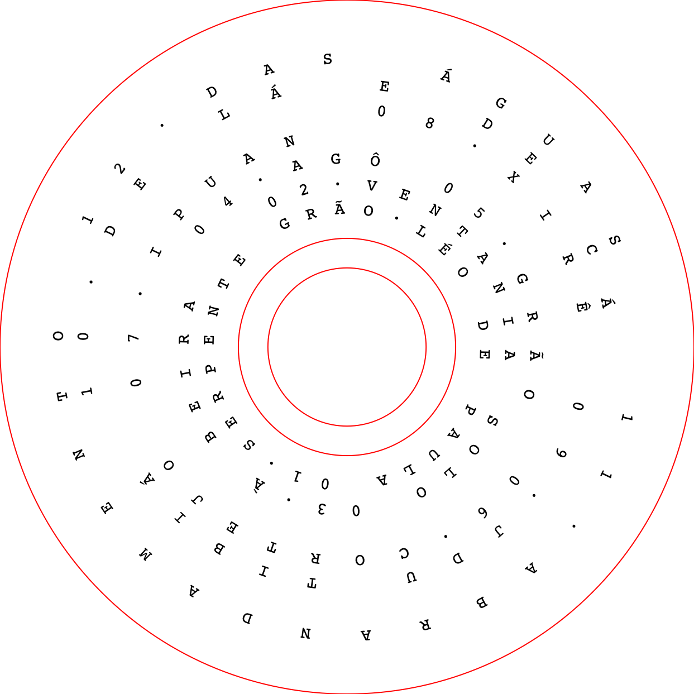
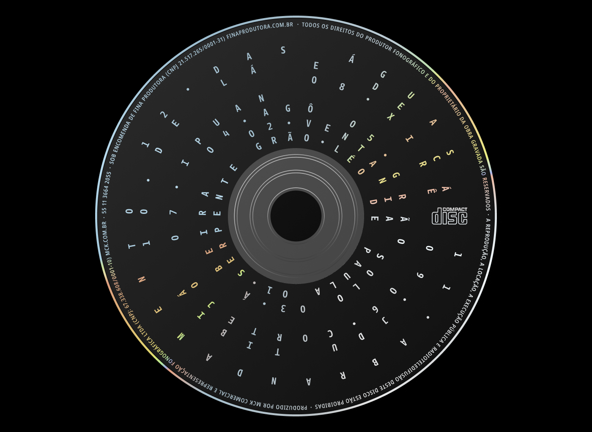
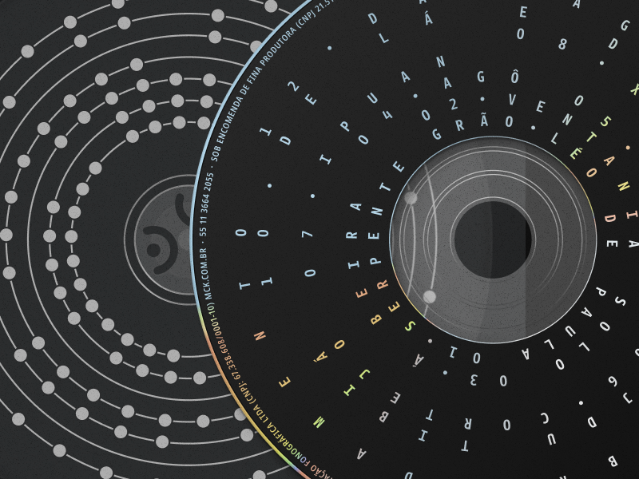

# Concentric Circles Text

Text written in concentric circles. Made with [DrawBot](https://www.drabot.com).

## About

This code was originally made for the visual identity of the music album **Grão — Território Percussivo**, by Léo de Paula.  

[Checkout the full process on Behance](https://www.behance.net/gallery/130839663/Grao-Territorio-Percussivo)  

[Listen to the music album on Spotify](https://open.spotify.com/album/3klOPziA8SREniODpKAsze?si=AC7oPuiCSduEyxzfPm9Kdg)

## Examples  

### Basic output  
.  

### The way that the output image was used on the compact disk  
  

  

## About the fonts used on this project
As it seems on the mockups, i've used the font [Botanika Mono](https://www.suitcasetype.com/fonts/botanika) (Tomáš Brousil / Suitcase Type Foundry) for the text. Because of licensing restrictions, this code has been set to work with the font [Space Mono](https://fonts.google.com/specimen/Space+Mono?query=mono) (Colophon / Google Fonts). Using a typography whose glyphs are the same width is preferable and produces a better result.
